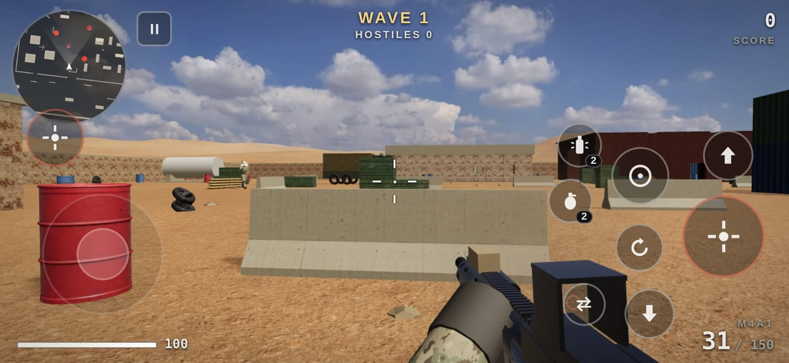

# Operation TIPS Mania

*TIPS ultimate FPS shooter game*

A tactical first-person shooter built for phones. You play in landscape with touch controls, and after the first load it runs completely offline. You hold a desert compound against waves of squad-based enemies that take cover, flank you, suppress you and throw grenades.



## Play it on your phone

The game is a static web app that installs itself as a Progressive Web App. It needs no app store and no server-side code.

1. **Host it with GitHub Pages (one time, free).** On GitHub open this repo, then go to **Settings → Pages**. Under *Build and deployment* choose **Deploy from a branch**, pick the branch with the game (`main` once merged, or `claude/mobile-offline-fps-game-we0og0`) and the **/ (root)** folder, then **Save**. About a minute later the game is live at
   `https://thomaspercival22-ui.github.io/Fps-shooter/`
2. **Open that link on your phone** while you're online. The first load downloads about 11 MB and caches everything.
3. **Install it** (this gives you a home-screen shortcut you can tap to play any time). The menu's **Add to Home Screen** button does this for you on Android, or shows the steps:
   - **Android (Chrome):** menu ⋮ → **Install app** (or **Add to Home screen**).
   - **iPhone (Safari):** Share → **Add to Home Screen**.
4. Launch it from the home-screen icon. It opens fullscreen in landscape and works in airplane mode.

> Tip: set **Graphics → Auto** (the default) and the game adjusts its render resolution to keep the frame rate smooth on your phone.

## What's in it

- **Realistic rendering:** 2K photo-scanned ground and wall textures, baked ambient occlusion (soft contact shading where walls, crates and sandbags meet the ground, darker interiors), eye adaptation when you step indoors, and sun glare with lens flare. An HDR post-processing pipeline gives filmic tone mapping, bloom around muzzle flashes, lamps and explosions, a lens vignette, film grain and subtle lens fringing. The desert has wind-swaying dry grass. Enemy soldiers carry the same detailed rifles you do and have fabric-weave and MOLLE surface detail.
- **Night missions:** choose **Mission → Night** in the menu. You get a moonlit sky full of stars, sodium security lamps, and darkness that makes enemies much slower to spot you. They wear night vision goggles too.
- **Night vision (NVG button / N key):** dual-tube PVS-31 style goggles with phosphor grain, auto-gain and bloom halos. Infrared aiming lasers, yours and the enemies', are only visible through them.
- **Thermal (THRM button / T key):** a white-hot sensor image. Tap again for black-hot, then ironbow, then off. Soldiers glow, gun barrels heat up as they fire, and dead bodies slowly cool.
- **FPV kamikaze drone (FPV button / V key):** you fly a 7-inch quad with a shaped-charge warhead through its analog video link. It has barrel distortion and static that gets worse with range and walls, and an on-screen display with battery voltage, signal strength (RSSI), altitude, speed and home distance. It arms after launch, then detonates on impact, near an enemy, or when you press fire. Enemies hear it buzzing, try to shoot it down, and scatter when it dives at them. You carry two, and the HQ ammo crate restocks them.

- **Modern weapons, modelled in detail:** an M4A1 carbine with a holographic sight, M-LOK rail, laser and light; an M1014 semi-auto shotgun with a side saddle and shell-by-shell reloads; a bolt-action sniper in a chassis stock with an 8x scope and working bolt; and a Glock 17 sidearm. Every gun has ADS, recoil you have to control, sway, bob, a sprint pose, tactical and empty reloads, ejected brass and dropped mags.
- **Guns that work like the real thing:**
  - **Magazines:** you carry individual magazines, not a pool of rounds. A tactical reload keeps the partly used mag in your pouch; an empty reload drops it. The pips next to the ammo count show full (▮) and partial (▯) mags, and there's a round in the chamber on a tactical reload (30+1).
  - **Fire selector (SEMI/AUTO button / B key):** switch the M4 between semi and full auto.
  - **Malfunctions:** guns occasionally jam, more often when they're hot. Tap reload to run the clear drill: tap the mag, rack the charging handle, and the stuck round flies out.
  - **Barrel heat:** long strings of fire heat the barrel, which opens up your groups, makes the muzzle smoke and glows on thermal.
  - **Moving parts:** the dust cover pops open on the first shot, the bolt carrier cycles with every round and locks back on an empty mag.
  - **Finish and detail:** worn Cerakote and anodised finishes with edge wear, scratches, dust and handling smudges; the M4 has an ejection port, trigger guard, grooved grip, castle nut, QD sling mounts and a sling.
- **Grenades:**
  - **Frag:** it bounces, rolls and has a fuse. The damage respects cover, and it sets off red fuel barrels.
  - **Flashbang:** it blinds every enemy looking toward it for several seconds. Blinded enemies stagger, cover their eyes and spray blindly. It will also white-out *your* screen (with a burned-in afterimage) and ring your ears if you look at it.
- **Smart enemy squads:**
  - **Senses:** they have vision cones and a detection meter. They are slower to spot you when you're crouched and quicker when you're moving or firing. They hear your gunshots, sprinting footsteps and even your reloads.
  - **Cover:** they pick real cover by testing it against your position, then alternate between hiding and peeking to fire bursts. They lead moving targets and suppress your last known position.
  - **Tactics:** a squad director sends flankers around by routes you're not looking at. When you reload, get flashed or run low on health, they rush you. They flush out campers with frags or flashbangs, dodge your grenades and fall back when wounded. They coordinate silently, so you never hear or read their chatter.
  - **Enemy types:** Riflemen, shotgun Assaulters who close distance, Marksmen with scope glint, and armoured LMG Heavies.
- **Realism details:**
  - **Ballistics:** bullets travel and drop, damage falls off with range, and headshots are deadly. Rounds punch through wood crates, sheet metal and containers, but concrete stops them.
  - **Visuals:** CC0 photo-scanned PBR textures and scanned props (a tarp-covered car, a generator, jerry cans, propane tanks, wall AC units, utility boxes, trash bags, security lights), a real HDR sky for lighting, sun shadows, impact dust, sparks and bullet holes. Enemy soldiers carry magazines in their pouches and wear helmet chinstraps and counterweights.
  - **Sound:** every sound is synthesized, with sound-travel delay, wall occlusion, bullet cracks and whizzes, and a tinnitus effect.
- **HUD:** a minimap that shows enemies who just fired, directional damage indicators, grenade warnings, a kill feed and scoring.
- **Difficulty levels:** Recruit, Regular, Veteran and Realism.

## Controls

**Touch**

| Action | How |
| --- | --- |
| Move | Put your thumb anywhere on the left side (floating joystick). Push past the rim to sprint. |
| Look | Drag anywhere on the right side. |
| Fire | The big red button. Keep holding it and slide your thumb to aim while firing. There's a second fire button on the left. |
| Aim (ADS / scope) | The ◎ button (toggle). |
| Reload, jump, crouch, switch weapon | The matching buttons. You can also tap the ammo counter to switch. |
| Frag / flashbang | The grenade buttons (they throw where you're looking). |

In settings you can adjust sensitivity, FOV, aim assist, and gyro aiming (off, while aiming, or always). **On-screen joystick & buttons → Always** also shows the touch controls on tablets and computers that don't report a touch screen.

**Keyboard & mouse:** WASD, Shift sprint, Space jump, C crouch, mouse aim, LMB fire, RMB aim, R reload, Q/1/2 switch, B fire selector, G frag, F flashbang, N night vision, T thermal, V drone, Esc pause.

## Running it locally (development)

```bash
npm install          # only needed for the tools below
npm run serve        # http://localhost:8080
```

Browsers only allow the offline service worker on `https://` or `localhost`. If you open the game from another device on your Wi-Fi, it will play, but it won't install for offline use. Use GitHub Pages for that.

After changing any game file, regenerate the offline cache list so installed copies update:

```bash
npm run build-sw
```

Other tools: `npm run fetch-assets` re-downloads and recompresses the textures and models (follow it with `npm run simplify-models` to decimate the scans to mobile triangle budgets), `npm run vendor` re-copies three.js into `vendor/`, and `npm run icons` redraws the app icons.

## Project layout

```
index.html, style.css      page, HUD and menus
manifest.webmanifest, sw.js   PWA: install + offline cache
src/
  main.js      boot, menus, settings
  game.js      main loop, waves, scoring, explosions, flashbangs
  level.js     the compound map, collision boxes, nav grid, cover points
  physics.js   collision world, ray casts, character movement
  nav.js       A* pathfinding
  player.js    movement, camera, health
  weapons.js   viewmodel animation, firing, reloading, grenade throws
  gunmodels.js procedural weapon + arm models
  ballistics.js  bullets, penetration, hit detection, tracers
  ai.js        enemy perception, decisions, squad director
  soldier.js   enemy character model and animation
  effects.js   particles, decals, brass, lights
  grenades.js  grenade physics
  audio.js     synthesized sound engine
  input.js     touch, gyro, keyboard, mouse
  hud.js       HUD, minimap, scope, flash effects
  textures.js  procedural textures
assets/        CC0 textures, props and sky (from Poly Haven)
vendor/three/  three.js (bundled so nothing loads from the internet)
```

## Credits

- 3D engine: [three.js](https://threejs.org) (MIT license, see `vendor/three/LICENSE`).
- Textures, props (barrels, tyres, ammo box, medical box, covered car, generator, jerry cans, propane tanks, AC units, utility boxes, trash bags, security lights) and the sky: [Poly Haven](https://polyhaven.com), released as CC0 (public domain).
- Weapons, soldiers, sandbags, HESCO barriers, all effects and all audio are generated in code.
